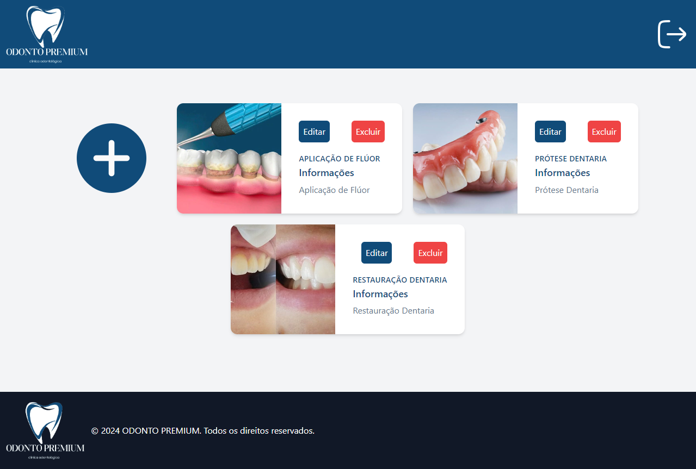

Projeto utilizando nodejs/handlebars/tailwind onde simula um catalogo de uma clínica odontológica (tendo a possibilidade de realizar o CRUD dos serviços)

INTEGRANTES:
  - DANILO
  - HENRIQUE
  - JOÃO VITOR
  - LUCAS
  - PAULO

VISÃO USER NORMAL

VISÃO ADMIN

Dependências que precisam ser instaladas para o funcionamento do projeto:
- npm install express –save
- npm install body-parser --save  
- npm install express-handlebars –save
- npm install mysql2 –save
- npm install sequelize --save
- npm install express express-session body-parser handlebars
- npm i express-fileupload
- npm install @tailwindcss/forms
- npm install tailwindcss

